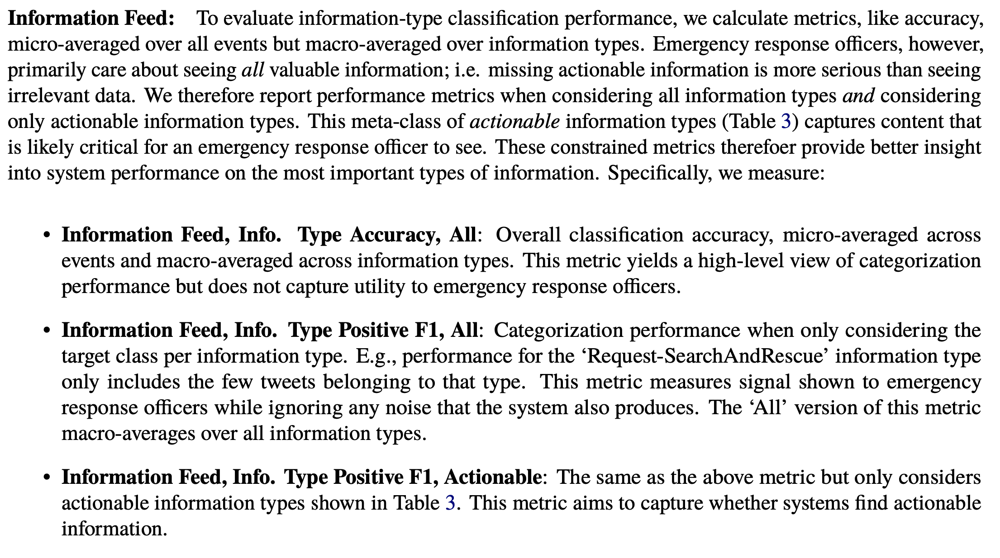
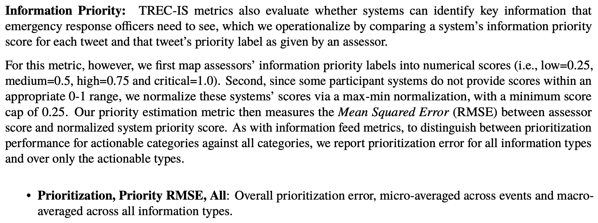

## Classification of tweets for aiding crisis and disaster management.

**[Dataset:](http://dcs.gla.ac.uk/~richardm/TREC_IS/2020/data.html)** 
>Dataset from Text Retrival Conference Incident Stream (TREC-IS) includes two labels. One is 'categories' label involving 25 information type, which is a multi-label classification task. Another is 'priority' label that includes four categories. It is a multi-class classification task.

**[Metrics:](http://dcs.gla.ac.uk/~richardm/TREC_IS/2020/ISCRAM_2020_TREC_IS.pdf)** 
> 
> 
> 

**[Data augmentation](https://github.com/jasonwei20/eda_nlp)**

* system_0: dataset processing (data cleaning, data augmentation)
* system_1: Logistic Regression
* system_2: bi-GRU and glove (multi-class)
* system_3: bi-GRU and glove (multi-label)

