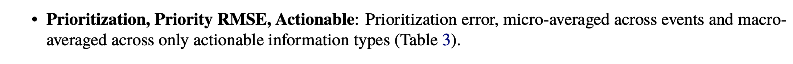

## Classification of tweets for aiding crisis and disaster management.

**[TREC-IS Dataset:](http://dcs.gla.ac.uk/~richardm/TREC_IS/2020/data.html)** 
>Dataset from Text Retrival Conference Incident Stream (TREC-IS) includes two labels. One is 'categories' label involving 25 information type, which is a multi-label classification task. Another is 'priority' label that includes four categories. It is a multi-class classification task.

**[2019 Metrics:](http://dcs.gla.ac.uk/~richardm/TREC_IS/2020/ISCRAM_2020_TREC_IS.pdf)** 
> 
> 
> 

**Project:**
>* system_0: dataset processing (data cleaning, data augmentation)
>* system_1: Logistic Regression
>* system_2: bi-GRU and glove (multi-class)
>* system_3: bi-GRU and glove (multi-label)
>* system_4: Bert (multi-class)

**Result:**
>
| Group | Actionable F1 | All F1 | All Accuracy | Actionable RMSE | All RMSE |
| :-: | :-: | :-: | :-: | :-: | :-: | 
|irlabISI| **0.1695** | **0.2825** | - | - | - |
|SC| - | - | **0.9039** | - | - |
|irlabISI| - | - | - | **0.1132** | - |
|BJUTDMS| - | - | - | - | **0.0563** |
>
| System | Actionable F1 | All F1 | All Accuracy | Actionable RMSE | All RMSE |
| :--: | :-: | :-: | :-: | :-: | :-: | 
| LR | - | 0.2426 | 0.8191 | - | 0.0401 |
| RNN | - |  | - | - | 0.0481 |
| Bert | - | - | - | - | 0.0523 |
| - | - | - | - | - | - |

