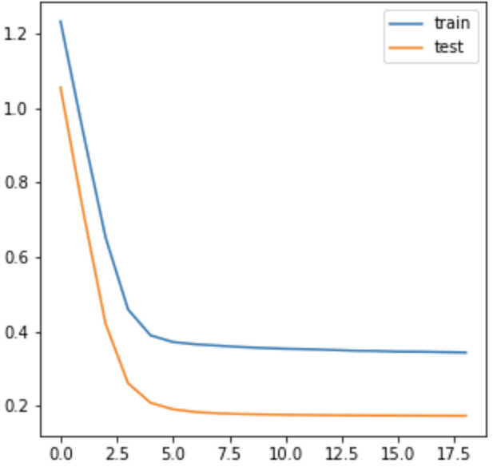
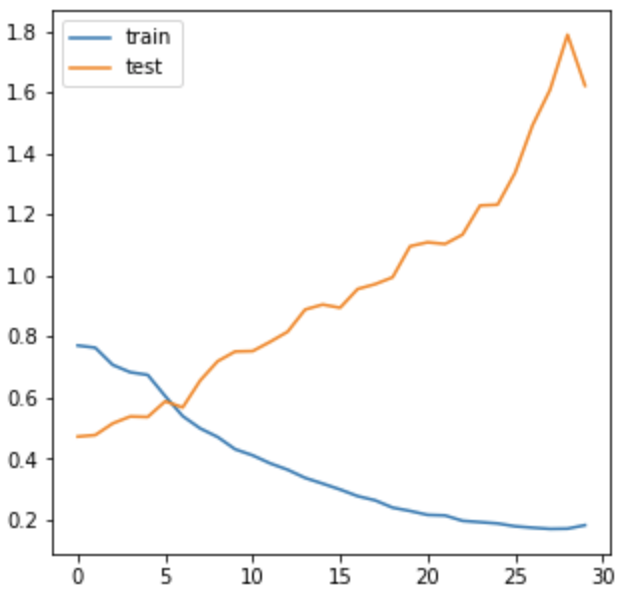

## Classification of tweets for aiding crisis and disaster management.

### TREC-IS 2019 overview:

* Dataset includes two labels. One is 'categories' label involving 25 information type, which is a multi-label classification task. Another is 'priority' label that includes four categories. It is a multi-class classification task.
* Metrics: F1-score and accuracy for actionable and all information type in multi-label task. RMSE for actionable and all information type in multi-class task.
* 6% participants use word embedding.
* Deep learning is increasing popular from 29% to 39%. However, classic machine learning is more effective.
* **No participants use link information!** "it seems likely that usage of such data is still largely unexplored for this task."
* System Performance:
<image src="image/overview.png" width="800">

### Eight Participants Notebook:
* CNN
* SIF sentence embeddings, pre-trained sentence embeddings, BERT word embeddings + DNN
* Data enhancement + glove.840B.300d + bi-lstm + NN
* TF-IDF + k-nearest neighbors.
* Feature engineering + GBT, Random Forest and linear regression.
* Data augmentation (GPT-2, smote) + bi-LSTM variants.

[TREC-IS Dataset](http://dcs.gla.ac.uk/~richardm/TREC_IS/2020/data.html),
[2019 TREC-IS overview](http://dcs.gla.ac.uk/~richardm/TREC_IS/2020/ISCRAM_2020_TREC_IS.pdf)

****

Idea: 
* **Use link in tweets.** However, many link is not accessable.
* **Use unlabel dataset.** semi-supervised learning or automatically label those unlabel dataset.
* **Relation between labels.** seq2seq for multi-label.
* **Multi-task learning.** convert two tasks into one task.

### My Project:
* system_0: dataset processing (data cleaning, data augmentation)
* system_1: Logistic Regression
* system_2: bi-GRU and glove (multi-class)
* system_3: bi-GRU and glove (multi-label)
* system_4: Bert (multi-class)
* system_5: Bert (multi-label)

### Result:

| Group | Actionable F1 | All F1 | All Accuracy | Actionable RMSE | All RMSE |
| :-: | :-: | :-: | :-: | :-: | :-: | 
|irlabISI| 0.1695 | 0.2825 | - | - | - |
|SC| - | - | 0.9039 | - | - |
|irlabISI| - | - | - | 0.1132 | - |
|BJUTDMS| - | - | - | - | 0.0563 |
| :-: | :-: | :-: | :-: | :-: | :-: | 
| LR | - | 0.2426 | 0.8191 | - | 0.0401 |
| RNN | - | **0.4735** | 0.9038 | - | 0.0476 |
| Bert | - | 0.4723 | **0.9076** | - | 0.0523 |
| - | - | - | - | - | - |

#### RNN:
>

#### Bert fine-tuning:
>

